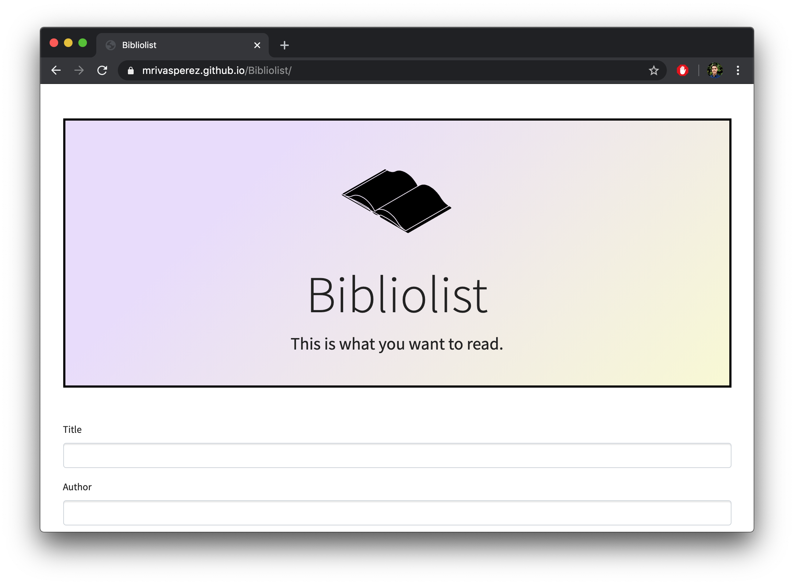
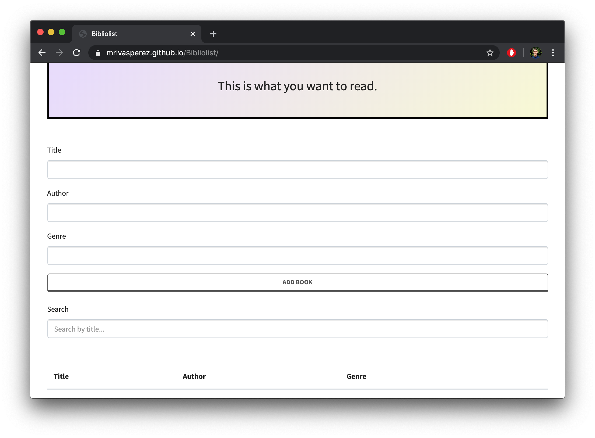

# Bibliolist - A place to keep track of the books you want to read. 
by mrivas perez live demo: <https://mrivasperez.github.io/Biblioteque/>

## About
Bibliolist is a part of my Bibliofiles project (still under development). It is an app where you can keep track of all of the books you want to read. I thought of the Bibliolist when wanting to keep a track of all the books I want to read, but not wanting to share that info with goodreads or other similar services. I developed Bibliolist using HTML, CSS, and Vanilla JS. Book data is stored in local storage.

## Screenshots

## Installation
You can use the app by visiting <https://mrivasperez.github.io/Bibliolist/>. Alternately, to run this app locally, download the repository as a zip file. Create a new folder in your system then drag and drop the contents of the zip file to that new folder. Double click "index.html" to open the page.

## Indepth description & guide
### UI Description
When you first open or visit Bibliolist you will be greeted with the main user interface. It is built using HTML and CSS. On the top section you will see a header that includes an image with black books, the name of the app, and a sentence describing the purpose of the app.

After the header, is the form that includes input for name of book, author of book, and genre of book.

Under the form, is the search input box where you can search books by their title.

The the search box, is the table where all books that the user has input are displayed.

### How to add a book
To add a book, fill out the form and click the "ADD BOOK" button. Once you add the book, a brief, green confirmation dialogue will appear. If you leave any of the fields blank, you will not be able to add a book and will be shown a red alert stating you must fill out all fields.

### How to remove a book
To remove a book, press the red "X" button to the right of the book you wish to remove. Once the book is removed, you will be shown an orange alert confirming the book was removed.

### Where is the book data stored?
The book data is stored in local storage, for this reason, it is important to keep all book data backed up in a local file. I am currently working on adding functionality to allow you to download the book data as a csv and a copy of the table in a pdf.

## Features under development
- Download table as pdf or list as csv

## Frameworks used and other credits
- Boostrap 4
- Lumen Boostrap theme by Bootswatch <https://bootswatch.com/lumen/>
- Image of books created by Lluisa Iborra from the Noun Project <https://thenounproject.com/marialuisa.iborra/>
